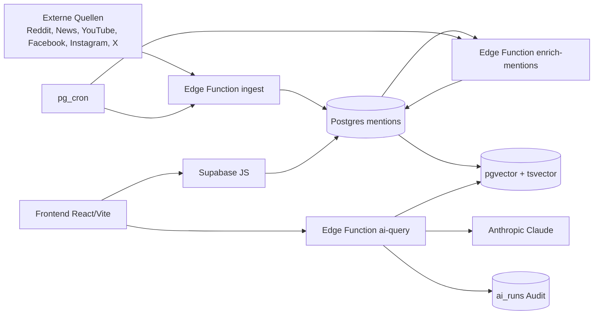

# Kapitel 4 - Vollstaendige App-Dokumentation

Status: Prototyp (Feature Freeze aktiv seit 2026-07-10)
Projekt: Smart Customer Feedback - Nordzucker AG

## 1. Zielbild und fachlicher Kontext

### 1.1 Problemstellung
Die Anwendung adressiert die Frage, wie sich oeffentliche Diskussionen zu Zucker, Softdrinks und suessen Speisen auf Nordzucker auswirken koennen. Klassische Social-Media-Auswertungen messen meist nur allgemeines Sentiment. Der Prototyp trennt dagegen:
- oeffentliche Stimmung (public sentiment)
- geschaeftliche Wirkung fuer Nordzucker (business impact)

Damit soll Management-relevante Frueherkennung moeglich werden, statt rein kommunikativer Reichweitenanalyse.

### 1.2 Fachliche Ziele
- kontinuierliche Sammlung oeffentlicher Signale aus mehreren Quellen
- semantische und fachliche Einordnung pro Mention
- Sicht auf Risiken, Chancen, Themen-Momentum und Wettbewerbsdruck
- Ableitung von Handlungsempfehlungen und Prognosen mit KI-Unterstuetzung
- Bereitstellung eines direkt nutzbaren Cockpits fuer Marketing und Vertrieb

### 1.3 Nutzungsziel des Prototyps
Der aktuelle Stand ist ein wissenschaftlich und praktisch nutzbarer Prototyp fuer:
- Demonstration der End-to-End-Architektur
- Validierung der Kennzahlenlogik
- explorative Entscheidungsunterstuetzung

Er ist nicht als final gehaertetes Serienprodukt konzipiert.

## 2. Systemueberblick

### 2.1 Gesamtarchitektur

### 2.2 Hauptbausteine
- Frontend: React Single-Page-App mit Analyse- und Steuerungsansichten
- Backend: Supabase (Postgres, RLS, pgvector, Edge Functions)
- KI-Schicht:
  - Klassifikation/Enrichment pro Mention
  - RAG-basierte Antworten und strukturierte Empfehlungen
- Scheduler: pg_cron fuer periodische Ingestion und Enrichment

## 3. Technologiestack

### 3.1 Frontend
- React 18
- Vite 5
- Recharts
- lucide-react
- react-markdown + remark-gfm
- @supabase/supabase-js

### 3.2 Backend
- Supabase Postgres
- Extensions: pgvector, pg_net, pg_cron
- Supabase Edge Functions (Deno Runtime)

### 3.3 KI
- Anthropic Claude fuer Klassifikation, Chat, Empfehlungen, Commercial Actions
- Embeddings:
  - Standard: Supabase gte-small (384)
  - Optional: OpenAI text-embedding-3-small (1536)

## 4. Frontend-Aufbau

### 4.1 Struktur
- Einstieg: frontend/index.html, frontend/src/main.jsx
- Hauptlogik: frontend/src/App.jsx
- Datenschicht:
  - frontend/src/data/index.js (Demo/Live-Umschaltung)
  - frontend/src/data/supabase.js (Live-Abfragen)
  - frontend/src/data/mock.js (deterministische Demo-Daten)

### 4.2 Zentrale Views
- Dashboard
- Trends & Risiken
- Wettbewerb
- Marketing & Vertrieb (Commercial Cockpit)
- Empfehlungen & Prognosen
- KI-Assistent
- Datenquellen/Schnittstellen
- BI Cube

### 4.3 Zentrale Frontend-Logiken
- Zeitraum-Filter: 7/14/30/90 Tage
- Analysefenster endet auf letztem abgeschlossenen Tag (bis gestern)
- Dynamische Chart-Skalierung im Stimmungsverlauf:
  - symmetrisch um 0
  - auf naechsten Zehner gerundet
- Exportfunktionen (CSV/PDF)
- Fallback-Verhalten bei Backend-Offlinesituationen

## 5. Backend-Aufbau

### 5.1 Edge Functions

#### ingest
Zweck:
- Multi-Source-Datenerfassung
- Vorfilterung, Deduplication, Persistenz in mentions
- YouTube-Quota-adaptive Strategie
- Wettbewerbs-/Keyword-Tracking

Merkmale:
- Cron-geschuetzt per x-cron-secret
- dryRun und Diagnostik faehig
- Term-Normalisierung und Pflichtterme (u. a. nordzucker/suedzucker)
- saisonale Fachterme integriert (einkochen, marmelade, gelierzucker etc.)

#### enrich-mentions
Zweck:
- asynchrones Nachanreichern roher Mentions
- Batch-Klassifikation via LLM
- Embedding-Erzeugung

Merkmale:
- Queue-Modell ueber enrichment_status (pending/in_progress/done/failed)
- begrenzte Parallelitaet fuer Stabilitaet
- robustes Fallback bei Analyse-/Embedding-Fehlern

#### ai-query
Zweck:
- KI-Zugriff fuer Frontend-Modi:
  - chat
  - recommendations
  - commercial_actions

Merkmale:
- Hybrid Retrieval (semantisch + keyword)
- Strukturierte JSON-Ausgaben
- Governance fuer Commercial Actions:
  - Confidence-Schwelle
  - accepted/dropped Actions
  - Evidence-Referenzen
  - Audit-Metadaten inkl. run_id
- Speicherung in ai_runs (Nachvollziehbarkeit)

#### admin-settings
Zweck:
- Pflege von app_settings ohne direkte SQL-Bedienung

Merkmale:
- Secret-geschuetzt per x-admin-secret
- Update von topic_catalog und source_catalog

### 5.2 Shared Module
- _shared/cors.ts: CORS-Header-Handling
- _shared/supabase.ts: Service-Role Client
- _shared/embeddings.ts: Embedding-Provider-Abstraktion
- _shared/llm.ts: Claude-Aufrufe + Batch-Analyse

## 6. Datenmodell (fachlich-technisch)

### 6.1 Kernobjekte
- sources:
  - Stammdaten der Datenquellen inkl. Status/last_sync
- mentions:
  - zentrale Beobachtungseinheit je externem Inhalt
  - source + external_id fuer Dedupe
  - public_sentiment und business_impact getrennt
  - topic, impact_reason, is_b2b
  - embedding fuer Retrieval
  - enrichment_status fuer Pipeline-Steuerung
- competitor_metrics:
  - Wochenwerte je Wettbewerber (Sentiment und SoV)
- competitor_profiles:
  - Alias-/Kontextregeln fuer Wettbewerber
- app_settings:
  - konfigurierbare Kataloge und Analyseparameter
- ai_runs:
  - Audit/Trace fuer KI-Aufrufe und Antworten
- youtube_quota_usage, youtube_term_stats:
  - Quota- und Keyword-Performance-Monitoring
- twitter_mentions_raw:
  - Rohpersistenz fuer X/Twitter-Metriken

### 6.2 Retrieval-Schicht
- pgvector fuer semantische Suche
- tsvector/Gin fuer BM25-Keyword-Suche
- RRF-Fusion in match_mentions

## 7. Datenfluss und Verarbeitungslogik

### 7.1 Pipeline
1. ingest sammelt Rohdaten aus APIs
2. Persistenz in mentions (ggf. pending)
3. enrich-mentions klassifiziert und erzeugt Embeddings
4. Frontend liest angereicherte Daten
5. ai-query erzeugt RAG-basierte Antworten/Empfehlungen

### 7.2 Zeitlogik
- Analyse und Visualisierung bis gestern (letzter abgeschlossener Tag)
- Verhindert irrefuehrende Null-Drifts auf laufendem Tagesfragment

### 7.3 Wettbewerbslogik
- Primardaten aus competitor_metrics
- Fallback-Berechnung aus mentions + competitor_profiles
- range-sensitives Windowing fuer 7/14/30/90 Tage

## 8. KI-Konzept

### 8.1 Trennung von Sentiment und Business-Impact
Die KI unterscheidet zwischen:
- "Wie klingt die Aussage?"
- "Was bedeutet sie wahrscheinlich fuer Nordzucker?"

Beispiel: positive Aussage zu "zuckerfrei" kann sprachlich positiv, aber geschaeftlich negativ fuer Zuckeranbieter sein.

### 8.2 RAG im System
- Anfrage wird embedded
- Hybrid-Match ueber relevante Mentions
- Kontextbelege werden der KI gegeben
- Antwort als strukturierter Output

### 8.3 Commercial Governance
Bei commercial_actions werden Actions:
- per confidence gefiltert
- mit evidence_refs/evidence versehen
- inklusive governance- und audit-Block zurueckgegeben

## 9. Konfiguration und Betrieb

### 9.1 Wichtige Secrets/Env
- ANTHROPIC_API_KEY
- ANTHROPIC_MODEL
- CRON_SECRET
- ALLOWED_ORIGINS
- REDDIT_CLIENT_ID, REDDIT_CLIENT_SECRET, REDDIT_USER_AGENT
- NEWSAPI_KEY
- YOUTUBE_API_KEY
- FACEBOOK_ACCESS_TOKEN, FACEBOOK_PAGE_ID
- INSTAGRAM_BUSINESS_ACCOUNT_ID
- optional: OPENAI_API_KEY, EMBEDDING_PROVIDER

### 9.2 Scheduler
- Ingest-Job: standardmaessig alle 6 Stunden
- Enrichment-Job: alle 15 Minuten

### 9.3 Betriebsdiagnostik
- adapterDiagnostics in ingest
- youtube_quota_usage fuer Quota-Steuerung
- ai_runs fuer KI-Audit
- Supabase Logs fuer Function-Fehleranalyse

## 10. Qualitaet und Validierung

### 10.1 Bereits umgesetzt
- wiederholte Frontend-Build-Validierungen
- datenlogische Korrekturen (unknown-Labeling, Term-Dedupe, Pflichtterme)
- UI-Verbesserungen fuer Interpretierbarkeit (Info-Hinweise)
- Governance-Erweiterung fuer LLM-Massnahmen

### 10.2 Prototypischer Qualitaetsrahmen
- Fokus auf Funktionalitaet und Nachvollziehbarkeit
- keine vollstaendige Test-/CI-Pipeline im aktuellen Stand

## 11. Known Limits (verpflichtender Abschnitt)

### 11.1 Daten- und Quellenlimits
- API-Quotas und Source-Verfuegbarkeit beeinflussen Datenvollstaendigkeit
- Plattformregeln koennen Endpunktverhalten kurzfristig aendern
- Coverage ist indikativ, nicht vollstaendig repraesentativ

### 11.2 Modell- und Analysegrenzen
- LLM-Ausgaben sind probabilistisch, nicht deterministisch
- Topic-/Impact-Klassifikation kann bei ambigen Texten fehlklassifizieren
- Embedding-Qualitaet ist providerabhaengig (gte-small vs. multilingual Modelle)

### 11.3 Metrikinterpretation
- Signale sind Entscheidungsunterstuetzung, kein automatischer Entscheidungsersatz
- Peaks koennen eventgetrieben sein und brauchen fachliche Plausibilisierung
- Business-Impact bleibt eine modellierte Naeherung

### 11.4 Wettbewerbsanalyse
- Alias-/Kontextregeln bestimmen Trefferqualitaet
- SoV-Fallback aus Mentions ist robust, aber vereinfachend

### 11.5 Betriebsgrenzen
- Keine vollstaendige Enterprise-Haertung im Prototypmodus
- Monitoring/Alerting ist grundlegend, nicht umfassend orchestriert

### 11.6 Produktgrenze
- Systemstatus: Prototyp mit Feature Freeze
- Nicht als final regulierter Produktionsstandard zu verstehen

## 12. Architekturentscheidung: Prototyp vs. Produkt

### 12.1 Prototypische Staerken
- schnelle End-to-End-Validierung
- hohe Fachnaehe (Nordzucker-Sicht statt generischer Sentimentmetriken)
- direkte Nutzbarkeit fuer Demonstration und explorative Analysen

### 12.2 Was fuer Vollproduktion fehlen wuerde
- tieferes Security Hardening
- durchgaengige CI/CD mit Tests
- Lasttests, formale SLO/SLI, Incident-Automation
- feingranulare Rollen-/Berechtigungsmodelle

## 13. Relevante Artefakte im Repository

- README.md
- backend/README.md
- backend/API_SETUP_GUIDE.md
- backend/SETUP_CHECKLIST.md
- backend/supabase/config.toml
- backend/supabase/functions/*
- backend/supabase/migrations/*
- frontend/src/App.jsx
- frontend/src/data/index.js
- frontend/src/data/supabase.js
- frontend/src/data/mock.js
- MVP_GO_LIVE_CHECKLIST.md
- PROTOTYPE_FREEZE.md

## 14. Zusammenfassung fuer Kapitel 4

Der Prototyp implementiert eine vollstaendige Analysekette von der Datenerhebung bis zur KI-gestuetzten Entscheidungsvorbereitung. Fachlich zentral ist die Trennung zwischen oeffentlicher Stimmung und geschaeftlicher Auswirkung fuer Nordzucker. Technisch wird dies durch eine Supabase-basierte Pipeline, hybride Retrieval-Mechanismen und ein mehrschichtiges React-Cockpit umgesetzt. Gleichzeitig sind die bekannten Grenzen transparent dokumentiert, wodurch die wissenschaftliche Einordnung der Ergebnisse methodisch abgesichert werden kann.
